# 【初识Node.js】用Node.js搭建一个简易留言板

## 开始
使用Node.js来简单实现一个留言板的基本功能
- 获取表单数据
- 提交表单重定向页面同时更新页面数据

**初始准备**
需要使用到的模板引擎：`art-template`

在终端中使用`npm install art-template`命令来进行安装（**注意**：在项目文件夹的首目录进行安装）

使用到的模板方法：
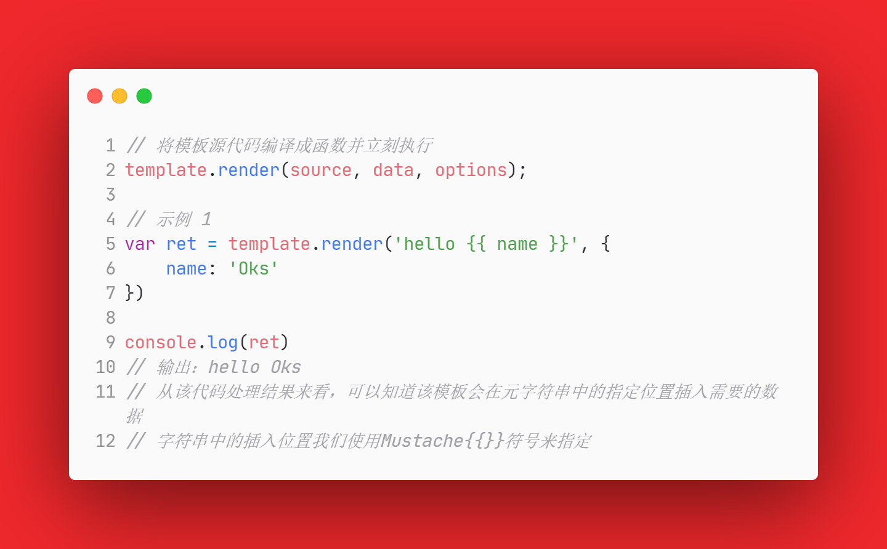

在正式开始前还需要了解到的几个Node.js模块
1. `fs` 进行文件交互，主要使用到的方法
    - `fs.readFile(path[, options], callback)`
        + `path` 文件或文件描述符（文件路径）
        + `callback` 回调函数中传入两个参数`err`和`data`
        其中`err` 是当文件读取失败时该参数为一个错误去对象，反之为null；`data`为文件数据内容，返回的是二进制
    ```
    // 示例
    fs.readFile('/test.text', (err, data) => {
      if (err) throw err;  // 读取错误抛出异常
      console.log(data);
    });
    ```
2. `http` 处理流处理和消息解析，用到的方法
    - `http.createServer([options][, requestListener])`
3. `url` URL的解析
    - `url.parse((urlString[, parseQueryString[, slashesDenoteHost])`
        + `urlString` 要解析的ULR字符串；例如：```https://nodejs.org/dist/latest-v12.x/docs/api/```
        + `parseQueryString` 传入一个Boolean值；如果为`true`会将返回对象中的`query`属性设置为一个对象；
        当传入的是`true`时,`query`中是一个对象
        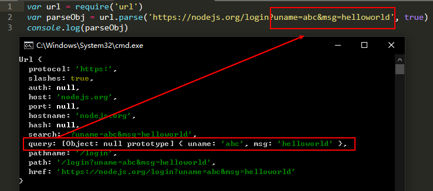
        当使用默认值（false）时，`query`是一个字符串
        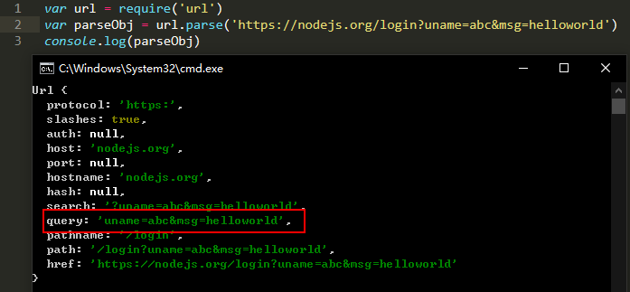
---
## 编码之html页面篇

开始这个项目前，先创建我们的工作目录，其结构如下：
```
-[Project_Nmae] // 主目录
  -[public] // 为了统一处理html文件中的静态资源，将这些文件存放在public目录中
    -[css]
    -[imgs]
    -...
  -[views] // 统一把html页面文件放在views中
    -index.html
    -post.html
    -...
  app.js // 我们的服务端应用脚本
```

根据需求来写一个静态页面，要满足什么功能，要实现什么样的状态
- 可以显示留言信息
- 可以发送表单请求

>注意：在html文件中对需要引入的文件资源路径有要求
浏览器收到HTML响应内容后，就要开始从上到下依次解析，
当在解析过程中，如果发现：link,script,img,iframe,video,audio等带有src或者(link的)href属性（具有外链资源）的时候，浏览器会自动对这些资源发起新的请求。
因为这些资源都是通过url标识来获取的：
`/  url根路径`
要把所有的路径都想象成网络地址
所以不能再使用相对路径，统一将这些路径改为/public/...的格式。

##### index页面
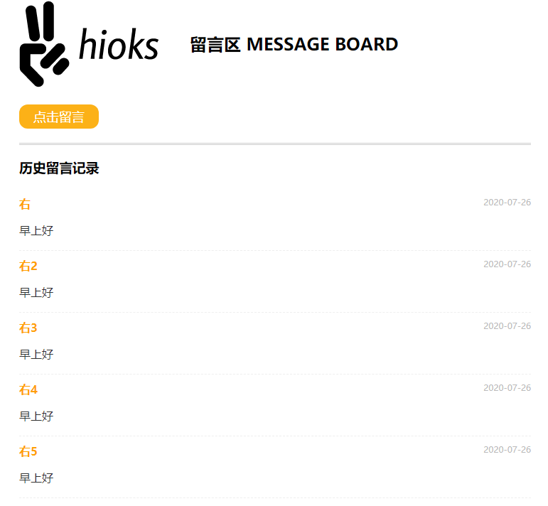
##### Post页面
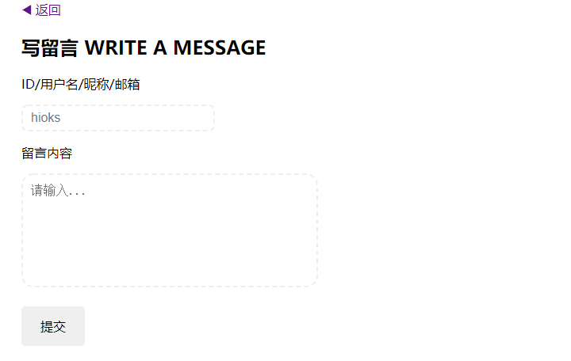


## 编码之服务端篇

##### 1. 首先引入需要用到的模板
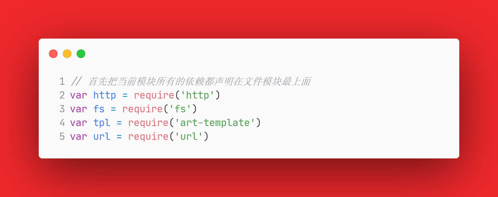

##### 2. 构建Web服务器
首先了解到构建Web服务器的一个基本步骤与方法
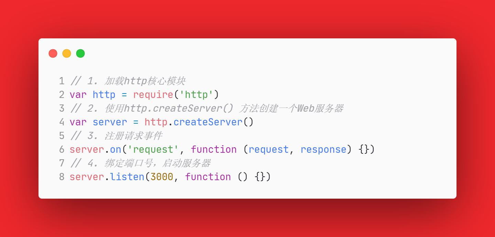

在此基础上再逐渐来完善其内部功能需求

##### 3. 注册请求事件
服务器端大部分操作与结果都将在该事件中进行
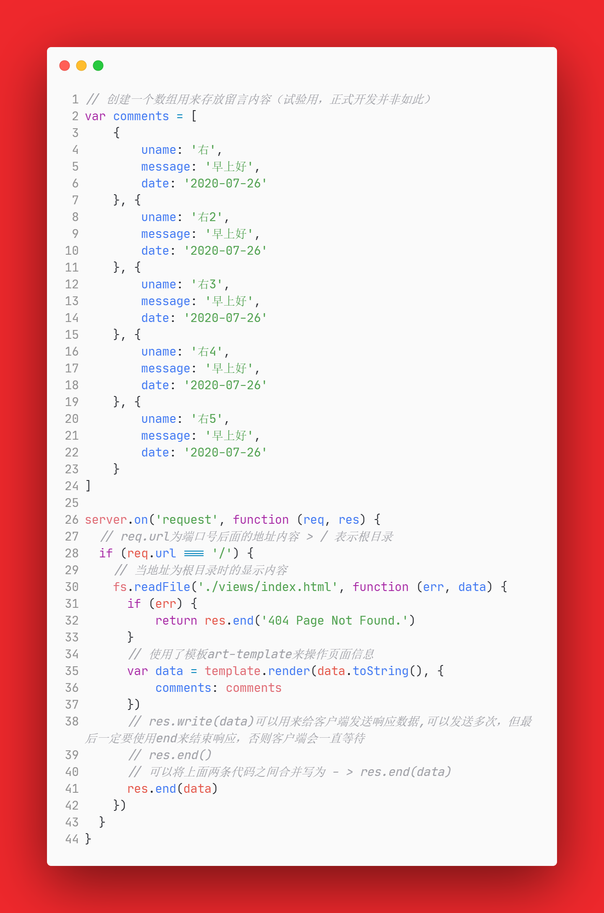

关于中间使用`art-template`来操作HTML页面的具体事项是：
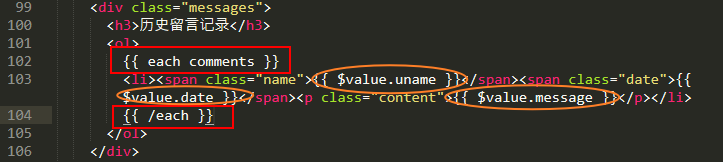
将HTML页面中需要插入的数据的位置使用一个`{{}}`符号来表示，中间是脚本中锁对应的数据(属性)名。当服务器运行发送请求后，服务器会将这些数据传入到页面中。当数据对象是一个数组，插入的内容结构一致时，就要在其外部使用`{{ each 数组对象名 }}{{ /each }}`来包括住，最终其会自动遍历生成我们需要的结构。

##### 4. 页面设置
页面显示方面，只需要使用一个`if-else`判断逐一的将每个页面设置一个对应的`pathname`，再采用读取文件的方式，把文件中的内容数据发送给客户端
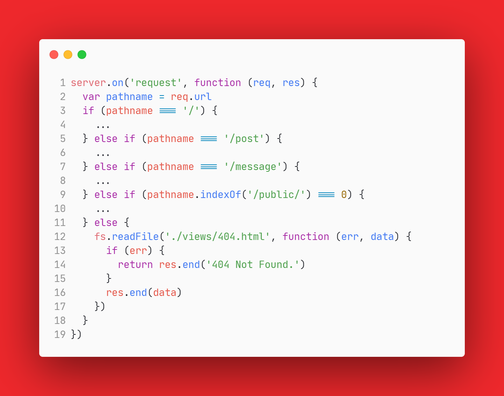

关于对`/public`目录下的外部资源文件请求处理的数据发送
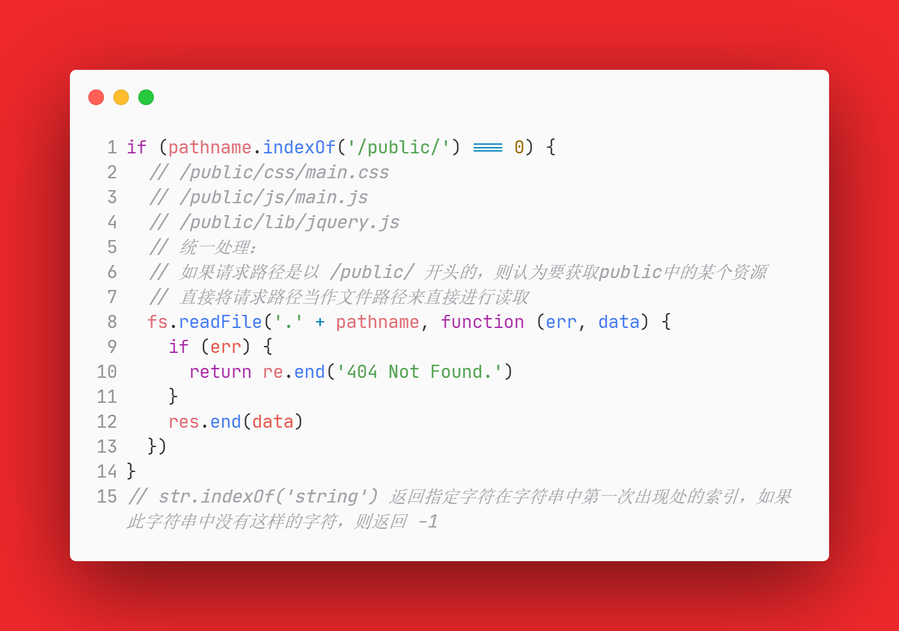

获取表单数据并将其存储到数据数组中，最后重定向页面
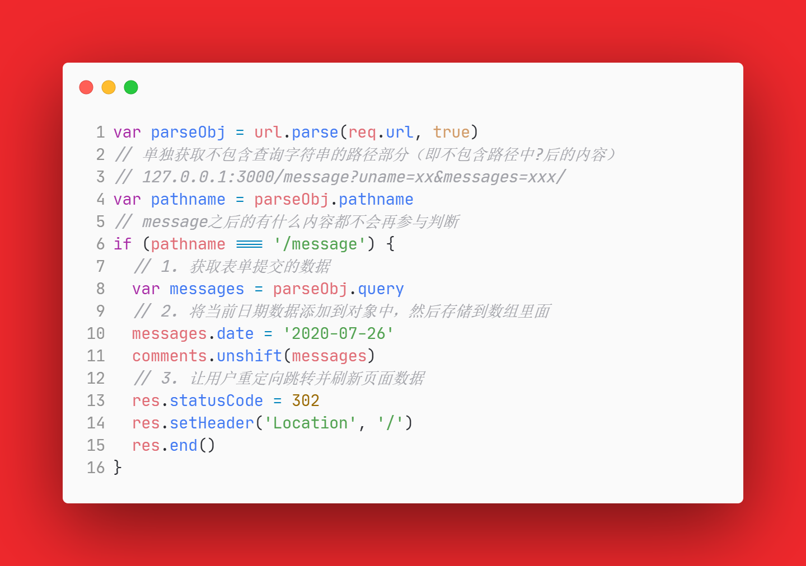
> 通过服务器让客户端重定向
>1) 状态码设置为**302**临时重定向 `statusCode`;
>2) 在响应头中通过Location告诉客户端往哪重定向 `setHeader`;
如果客户端发现收到服务器的状态响应码为**302**就会自动去响应头中找Location


## 总结

实现了一个基础的服务器，对于请求的发送，与如何把数据从服务器发送给客户端的问题有了一个解决方法。也认识和了解到了服务器运行的一些基本知识与逻辑。