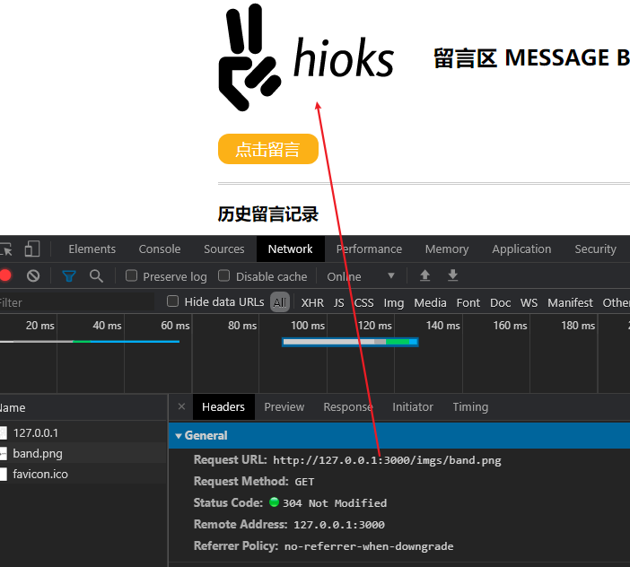
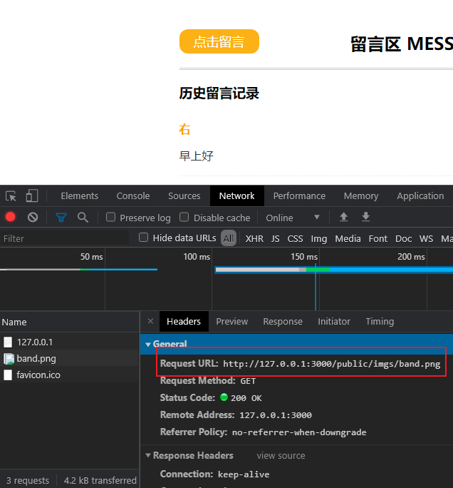
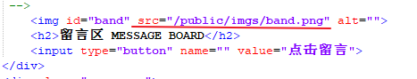
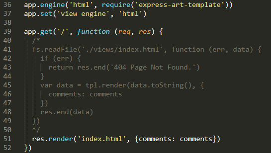

# 【初识Node.js】用Node.js搭建一个简易留言板

## <span id="tohead">开始</span>

> 07/27 更新 使用了Expres框架来搭建 [跳转查看](#jump)

使用Node.js来简单实现一个留言板的基本功能
- 获取表单数据
- 提交表单重定向页面同时更新页面数据

**初始准备**
需要使用到的模板引擎：`art-template`

在终端中使用`npm install art-template`命令来进行安装（**注意**：在项目文件夹的首目录进行安装）

使用到的模板方法：


在正式开始前还需要了解到的几个Node.js模块
1. `fs` 进行文件交互，主要使用到的方法
    - `fs.readFile(path[, options], callback)`
        + `path` 文件或文件描述符（文件路径）
        + `callback` 回调函数中传入两个参数`err`和`data`
        其中`err` 是当文件读取失败时该参数为一个错误去对象，反之为null；`data`为文件数据内容，返回的是二进制
    ```
    // 示例
    fs.readFile('/test.text', (err, data) => {
      if (err) throw err;  // 读取错误抛出异常
      console.log(data);
    });
    ```
2. `http` 处理流处理和消息解析，用到的方法
    - `http.createServer([options][, requestListener])`
3. `url` URL的解析
    - `url.parse((urlString[, parseQueryString[, slashesDenoteHost])`
        + `urlString` 要解析的ULR字符串；例如：```https://nodejs.org/dist/latest-v12.x/docs/api/```
        + `parseQueryString` 传入一个Boolean值；如果为`true`会将返回对象中的`query`属性设置为一个对象；
        当传入的是`true`时,`query`中是一个对象
        
        当使用默认值（false）时，`query`是一个字符串
        
---
## 编码之html页面篇

开始这个项目前，先创建我们的工作目录，其结构如下：
```
-[Project_Nmae] // 主目录
  -[public] // 为了统一处理html文件中的静态资源，将这些文件存放在public目录中
    -[css]
    -[imgs]
    -...
  -[views] // 统一把html页面文件放在views中
    -index.html
    -post.html
    -...
  app.js // 我们的服务端应用脚本
```

根据需求来写一个静态页面，要满足什么功能，要实现什么样的状态
- 可以显示留言信息
- 可以发送表单请求

>注意：在html文件中对需要引入的文件资源路径有要求
浏览器收到HTML响应内容后，就要开始从上到下依次解析，
当在解析过程中，如果发现：link,script,img,iframe,video,audio等带有src或者(link的)href属性（具有外链资源）的时候，浏览器会自动对这些资源发起新的请求。
因为这些资源都是通过url标识来获取的：
`/  url根路径`
要把所有的路径都想象成网络地址
所以不能再使用相对路径，统一将这些路径改为/public/...的格式。

##### index页面

##### Post页面


## 编码之服务端篇

##### 1. 首先引入需要用到的模板


##### 2. 构建Web服务器
首先了解到构建Web服务器的一个基本步骤与方法


在此基础上再逐渐来完善其内部功能需求

##### 3. 注册请求事件
服务器端大部分操作与结果都将在该事件中进行


关于中间使用`art-template`来操作HTML页面的具体事项是：

将HTML页面中需要插入的数据的位置使用一个`{{}}`符号来表示，中间是脚本中锁对应的数据(属性)名。当服务器运行发送请求后，服务器会将这些数据传入到页面中。当数据对象是一个数组，插入的内容结构一致时，就要在其外部使用`{{ each 数组对象名 }}{{ /each }}`来包括住，最终其会自动遍历生成我们需要的结构。

##### 4. 页面设置
页面显示方面，只需要使用一个`if-else`判断逐一的将每个页面设置一个对应的`pathname`，再采用读取文件的方式，把文件中的内容数据发送给客户端


关于对`/public`目录下的外部资源文件请求处理的数据发送


获取表单数据并将其存储到数据数组中，最后重定向页面

> 通过服务器让客户端重定向
>1) 状态码设置为**302**临时重定向 `statusCode`;
>2) 在响应头中通过Location告诉客户端往哪重定向 `setHeader`;
如果客户端发现收到服务器的状态响应码为**302**就会自动去响应头中找Location

---
## <span id="jump">【07/27update】使用Express框架来重新构造服务器内容</span>

### 1. 安装Express框架

```
1. npm init -y  > 使用 npm init 命令为应用程序创建 package.json 文件，加上 -y 使用默认配置
2. npm install express --save > 添加 --save  用于将Express保存在依赖列表中
```

### 2. 开始使用Express来构建服务器

   + 在代码中引用框架
    ```
    var express = require('express')
    ```
   + 创建服务器应用程序( 这行代码类似于 `http.createServer`)
    ```
    var app = express()
    ```
   + 获取请求
    ```
    app.get('/', function (req, res) {
      res.end('hello expressjs')
    })
    ```
    + 绑定端口号
    ```
    app.listen(3000, function () {
      console.log('app is running at port 3000.')
    })
    ```

### 3. 调用外部资源

与之前使用`http`模块创建服务器的步骤方法一样，但`Express`框架提供的方法更加灵活。
在`Express`框架中要使用外部资源的方法如下：
```
将包含静态资源的目录的名称传递给 express.static 中间件函数，以便开始直接提供这些文件
1. app.use(express.static('public'))
>> http://localhost:3000/images/kitten.jpg
>> http://localhost:3000/css/style.css
>> http://localhost:3000/js/app.js
>> http://localhost:3000/images/bg.png
>> http://localhost:3000/hello.html

要为 express.static 函数提供的文件创建虚拟路径前缀（路径并不实际存在于文件系统中），要为静态目录指定安装路径
2. app.use('/public/', express.static('public'))
>> http://localhost:3000/public/images/kitten.jpg
>> http://localhost:3000/public/css/style.css
>> http://localhost:3000/public/js/app.js
>> http://localhost:3000/public/images/bg.png
>> http://localhost:3000/public/hello.html
```
上面两种方法的区别就是：
- **方式一**： `Express` 是相对于静态目录查找文件，因此静态目录的名称不是此 URL 的一部分。
- **方式二**： 访问具有 `/public` 路径前缀的 public 目录中的文件，如果路径中不添加 `/public` 则访问不到文件

 > 当使用第一种方法时：

> 路径中不带 /public/ 可以正常访问到文件

> 而当在路径中加上`/public/`就会找不到文件


> 要解决这个问题，只需要将html文件中的资源文件的引用路径做一个修改



### 4. Express使用art-template模板引擎

在`Express`中使用`art-template`的方式将变得很简单:

##### 安装需要的模板

由于`express-art-template`会依赖`art-template`，如果没安装的话也需要一并安装
```Shell
npm install --save art-template
npm install --save express-art-template
```

##### 例子
```Javascript
var express = require('express')
var app = express()

// view engine setup
// 这是关键的代码，第一个参数表示将使用模板引擎文件的后缀名
// 这里为html即表示使用的模板引擎文件将是一个后缀名为html的文件
app.engine('html', require('express-art-template'))
//app.set('view', {
//  debug: process.env.NODE_ENV !== 'production'
//});

// 这行代码可以修改默认路径(默认为views)
//app.set('views', path.join(__dirname, 'views'));
app.set('view engine', 'html')

// routes
app.get('/', function (req, res) {
  // 由于默认路径为views，所以这里的文件名不需要再添加相对路径
  // 若模板引擎文件index.html是位于views文件夹中的art文件夹中，那么这里就要写成/art/index.html
  res.render('文件名', {模板数据})
})
```

##### 应用

掌握了基本方法后，就按照这个要求对代码中的结构做相应改动，最终结果如下：



可以看到代码量大大减少了，现在只用一行代码就能实现对客户端数据发送的要求了。
相比较而言，结构方面也显得更加简洁直观。

---
## 总结 [👆TOHEAD](#tohead)

实现了一个基础的服务器，对于请求的发送，与如何把数据从服务器发送给客户端的问题有了一个解决方法。也认识和了解到了服务器运行的一些基本知识与逻辑。

使用`Express`框架能更加迅速、快捷、直观的将服务器的基本框架构建出来，不同于`http`模块中繁琐的发送请求事件方法，`Express`可以更加清晰明了的处理每一个事件操作。相信在后续的学习之中可以探索到它更加强大且好用的功能。